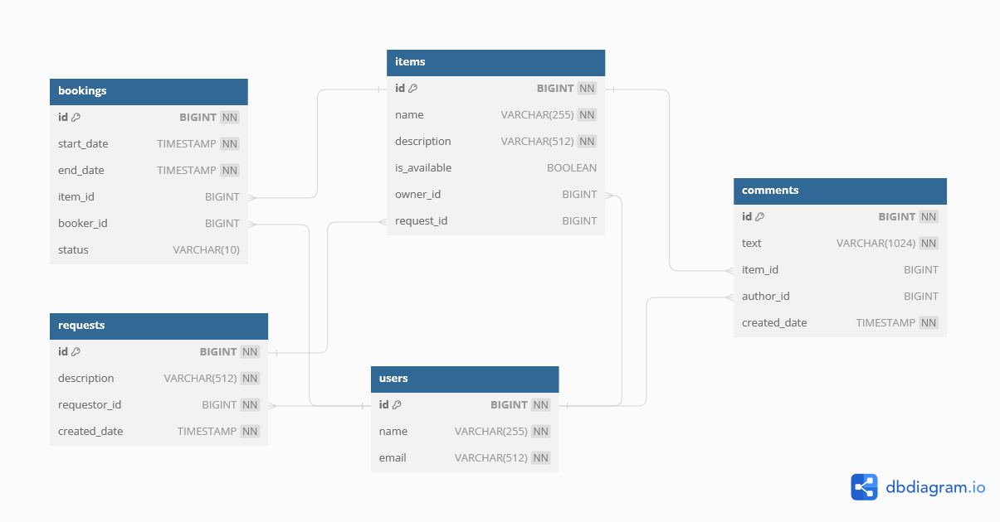

# ShareIt
Cервис шэринга вещей. Позволяет пользователям рассказывать, какими вещами они
готовы поделиться, брать вещи в аренду, оставлять комментарии, создавать запросы на вещи которые они бы взяли в аренду.

Стек: REST-сервис с использованием Spring Boot, Maven, Lombok, Docker и взаимодействие с БД
(PostgreSQL) с помощью JPA.

DB scheme

